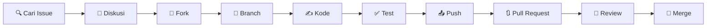

# Panduan Kontribusi

Terima kasih atas minat Anda untuk berkontribusi ke OpenRiset Website! 🎉

Dokumen ini menjelaskan alur kerja dan konvensi yang kami gunakan. Baca dengan saksama sebelum memulai.

## 📋 Daftar Isi

- [Kode Etik](#kode-etik)
- [Sebelum Memulai](#sebelum-memulai)
- [Alur Kontribusi](#alur-kontribusi)
- [Jenis Kontribusi](#jenis-kontribusi)
- [Konvensi Kode](#konvensi-kode)
- [Commit Messages](#commit-messages)
- [Pull Request](#pull-request)
- [Development Setup](#development-setup)

---

## Kode Etik

Proyek ini mengadopsi [Contributor Covenant](./CODE_OF_CONDUCT.md). Dengan berpartisipasi, Anda setuju untuk mematuhi ketentuannya. Harap laporkan perilaku yang tidak dapat diterima ke **openriset@proton.me**.

## Sebelum Memulai

1. **Cari issue yang ada** — Mungkin sudah ada yang mengerjakan hal yang sama
2. **Buka issue baru** jika Anda ingin mengusulkan fitur atau melaporkan bug
3. **Tunggu diskusi** — Beberapa perubahan mungkin perlu persetujuan terlebih dahulu
4. **Tanyakan jika ragu** — Lebih baik bertanya daripada menebak

## Alur Kontribusi



### Langkah Detail

#### 1. Fork dan Clone

```bash
# Fork repo ini melalui GitHub UI, lalu:
git clone https://github.com/[username-anda]/openriset.github.io.git
cd openriset.github.io
git remote add upstream https://github.com/openriset/openriset.github.io.git
```

#### 2. Buat Branch

```bash
git checkout -b feat/nama-fitur
# atau
git checkout -b fix/deskripsi-bug
```

Gunakan prefiks yang sesuai:
- `feat/` — fitur baru
- `fix/` — perbaikan bug
- `docs/` — dokumentasi
- `style/` — perubahan UI/CSS
- `refactor/` — restrukturisasi kode
- `perf/` — optimasi performa
- `chore/` — maintenance

#### 3. Development

```bash
bun install        # install dependencies
bun run dev        # jalankan dev server
bun run check      # type check
```

#### 4. Commit

```bash
git add -A
git commit -m "feat: tambah halaman FAQ"
```

Lihat [Commit Messages](#commit-messages) untuk format yang benar.

#### 5. Push dan Pull Request

```bash
git push origin feat/nama-fitur
# Buka pull request melalui GitHub UI
```

## Jenis Kontribusi

### 🐛 Laporan Bug

Gunakan template **Bug Report** saat membuka issue. Sertakan:
- Langkah untuk mereproduksi
- Perilaku yang diharapkan vs aktual
- Screenshot jika relevan
- Browser dan OS yang digunakan

### ✨ Fitur Baru

Gunakan template **Feature Request**. Jelaskan:
- Masalah yang ingin diselesaikan
- Solusi yang diusulkan
- Alternatif yang sudah dipertimbangkan

### 📝 Dokumentasi

Perbaiki typo, tambahkan contoh, atau terjemahkan konten. Dokumentasi sama pentingnya dengan kode.

### 🎨 Desain & UI

Perbaikan tampilan, responsivitas, aksesibilitas, atau animasi sangat diterima.

### ⚡ Performa

Optimasi ukuran halaman, kecepatan loading, atau Core Web Vitals.

## Konvensi Kode

### TypeScript

```typescript
// ✅ BENAR
interface Props {
  title: string;
  count: number;
}

// ❌ SALAH — jangan any atau suppress
const data: any = fetchData();
// @ts-ignore
```

### Astro Components

```astro
---
// ✅ BENAR — typed Props
interface Props {
  title: string;
  description?: string;
}

const { title, description } = Astro.props;
---

<!-- ✅ BENAR — semantic HTML -->
<section id="fitur">
  <h2>{title}</h2>
  {description && <p>{description}</p>}
</section>
```

### Tailwind CSS

```html
<!-- ✅ BENAR — utility classes -->
<div class="max-w-6xl mx-auto px-4 py-16">

<!-- ❌ SALAH — jangan custom CSS -->
<style>
  .custom-class { margin: 0 auto; }
</style>
```

### File Naming

| Jenis | Format |
|---|---|
| Komponen Astro | `PascalCase.astro` |
| Halaman | `kebab-case/` directory |
| File konfigurasi | `kebab-case.ext` |

## Commit Messages

Kami mengikuti [Conventional Commits](https://www.conventionalcommits.org/):

```
<type>: <deskripsi singkat>

[opsional: body yang menjelaskan WHAT dan WHY]
```

**Types:**

| Type | Kegunaan |
|---|---|
| `feat` | Fitur baru |
| `fix` | Perbaikan bug |
| `docs` | Dokumentasi |
| `style` | UI/CSS (bukan logic) |
| `refactor` | Restrukturisasi kode |
| `perf` | Optimasi performa |
| `test` | Testing |
| `chore` | Maintenance |

**Contoh:**
```
feat: tambah komponen Timeline untuk roadmap
fix: perbaiki overflow teks di mobile Card
docs: tambah panduan deploy ke README
```

## Pull Request

### Checklist Sebelum Submit

- [ ] Kode mengikuti konvensi proyek
- [ ] `bun run check` — 0 errors, 0 warnings
- [ ] `bun run build` — build sukses
- [ ] Tidak ada file yang tidak relevan ter-commit
- [ ] Commit messages mengikuti conventional commits
- [ ] PR description menjelaskan WHAT dan WHY
- [ ] Screenshot disertakan untuk perubahan UI

### Review Process

1. **Automated checks** — Type check dan build harus lolos
2. **Human review** — Minimal 1 maintainer harus approve
3. **Revisi** — Address feedback, push ulang ke branch yang sama
4. **Merge** — Maintainer akan merge setelah disetujui

## Development Setup

### Prasyarat

- **Bun** ≥ 1.2 atau **Node.js** ≥ 22
- Git

### Instalasi

```bash
git clone https://github.com/openriset/openriset.github.io.git
cd openriset.github.io
bun install
bun run dev
```

### Testing

```bash
bun run check        # TypeScript check
bun run check:watch  # Watch mode
```

---

## ❓ Pertanyaan?

Buka [Discussion](https://github.com/openriset/openriset.github.io/discussions) atau [Issue](https://github.com/openriset/openriset.github.io/issues).

Atau hubungi langsung: **openriset@proton.me**

---

<p align="center">
  <sub>Terima kasih telah berkontribusi! 🇮🇩</sub>
</p>
